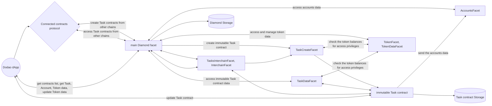

### Diamond HLD diagram

```mermaid
graph LR
diamond[main Diamond facet] -- create immutable Task contract --> TaskCreateFacet[TaskCreateFacet] --> TaskContract
diamond -- access immutable Task contract data <--> TaskDataFacet[TaskDataFacet] <--> TaskContract
diamond -- access accounts data <--> AccountsFacet[AccountsFacet]
diamond -- access and manage token data <--> TokenFacet[TokenFacet, TokenDataFacet]
TaskContract[immutable Task contract] -- send the accounts data --> AccountsFacet[AccountsFacet]
TaskCreateFacet -- check the token balances for access privileges <--> TokenFacet
TaskDataFacet -- check the token balances for access privileges <--> TokenFacet
ConnectedContracts{Connected contracts protocol} -- create Task contracts from other chains <--> diamond <--> TasksInterchainFacet[TasksInterchainFacet, InterchainFacet] --> TaskCreateFacet
ConnectedContracts -- access Task contracts from other chains <--> diamond <--> TasksInterchainFacet <--> TaskContract
diamond --> diamondStorage[(Diamond Storage)]
TaskContract --> taskContractStorage[(Task contract Storage)]
app((Dodao dApp)) -- get contracts list, get Task, Account, Token data, update Token data <--> diamond
app -- update Task contract <--> TaskContract
app --> ConnectedContracts
```