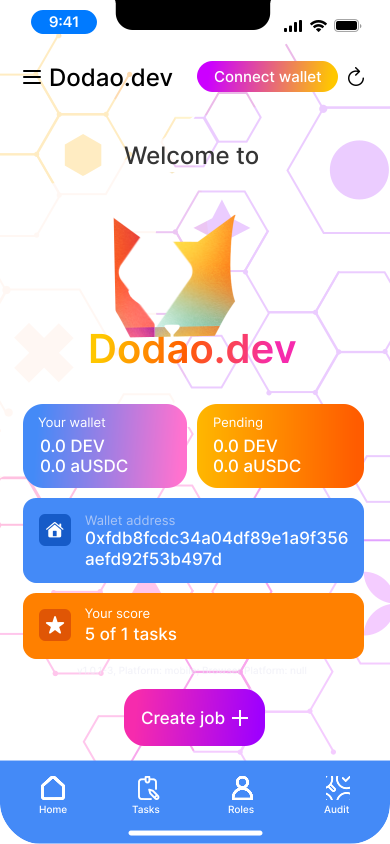
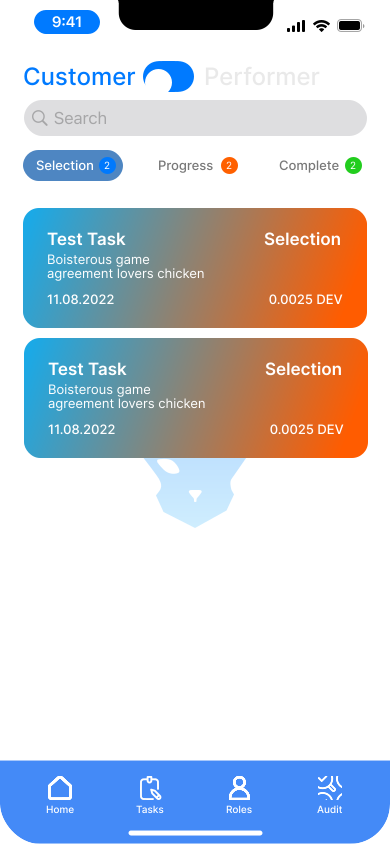

# How Dodao dApp works

At the moment, you can test the Devopsdao WebApp on [dodao.dev](https://dodao.dev) or download latest [Android release](https://github.com/devopsdao/devopsdao/tags), later we will release for iOS and Microsoft. 

1. First get some Moonbase Alpha DEV test tokens from the [faucet](https://apps.moonbeam.network/moonbase-alpha/faucet/)

2. Open the dApp, connect your wallet

3. Creating a Job

Create a Job to find matching performers

4. Minting in the Blockchain

After your Job is minted in the Blockchain, Performers can apply.

5. Tasks exchange page

Performers can find all open Tasks on Tasks exchange page.

6. Customer page

Customer finds all Tasks on Customer page.

7. Performer page

Perfomer find all applied Tasks on Performer page.

8. Auditor page

At certain stages of the Task both the customer and performer can request an audit.

