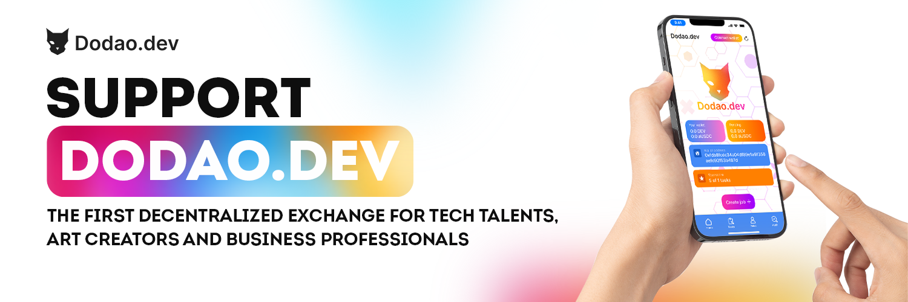

# About dodao

Let's discover **Dodao in less than 5 minutes**.

dodao.dev is a decentralized and permissionless marketplace for tech talents and art creators.
DApp takes advantage of EIP-2535 Diamond based smart contract DAO upgradeability, ERC-1155 multitoken flexibility, Flutter crossplatform support and several omnichain layers.
Dodao is built to be integrated into Ethereum compatible blockchain ecosystem and a truly community governed project.

dodao.dev allows for greater scalability and flexibility. With dodao and its NFT tag enhanced workflow, teams can easily scale up or down as needed, and can also easily add or remove team members. This allows for a more dynamic and flexible workflow, which is essential for successful software development and operations.

# Dodao workflow details

Dodao.dev dApp is built as an uniform platform to bring all software development processes to blockchain. It will be used as work marketplace for developers and art creators. Dodao.devusers currently have three roles:

- customer
- performer
- auditor

Customer is able to create Task contract with DEV and aUSDC tokens as a reward. Once Performers apply for a Task, Customer is able to select the Performer for Task implementation. After the Task is implemented the Performer applies for a Customer review. Currently all negotiations are performed off-chain via Customer selected method (such as Telegram or Discord for example). When Customer is happy with the work done, he signs the review and the Performer will be able to withdraw the tokens to his preferred blockchain supported by Axelar (Moonbase, Ethereum, Binance, Fantom, Avalanche, Polygon). If any dispute occurs an Auditor can be invited to review the task and settle it.

    At the moment, we are live on Testnet, planning to launch in Mainnet soon. Because, we build this dApp for all of us as a community, we need your feedback to build a dApp, we all want to use.

## Dodao technology highlights

blockchain: Moonbeam
Connected contracts: Axelar, Hyperlane, LayerZero, Wormhole
storage: arweave
App: Dart, Flutter, Walletconnect
Smart contract: Solidity, Ethereum EIP-2535 Diamonds, EIP-1155 multi token contracts

Devopsdao dApp is built on Flutter 3 powered by Dart language. Framework optimized for fast native apps on any platform.

Devopsdao is a early bird blockchain project based on Flutter, taking the advantage to be presented on major platforms. Devopsdao EIP-2539 based smart contract Diamonds are compiled with hardhat and depend on Axelar GMP SDK for cross-chain interoperability. Devopsdao web app is served from Arweave decentralized cloud.

Implemented Axelar, Hyperlane, Layerzero and Wormhole smart contacts as Diamond facets to enable cross-chain features.

devopsdao dApp is deployed on Moonbase-alpha and is available via Axelar GMP from Axelar supported blockchains. It is also available via Hyperlane, Wormhole and LayerZero bridges.

For Web3 interaction we support our own WebThree library.

### Contributing

- [dodao.dev dAPP repository](https://github.com/devopsdao/devopsdao), Dart/Flutter
- [dodao.dev smart contract repostory](https://github.com/devopsdao/devopsdao-smart-contract-diamond), Solidity/Hardhat

## Testing

1. Apply for [dodao.dev dAPP testing program](https://www.devopsdao.com/devopsdao-dapp-testing-program/), read more in [medium article](https://dodao.medium.com/test-the-devopsdao-dapp-from-customer-perspective-585b1c3babda)
2. Open [dodao.dev dApp](https://dodao.dev) or download latest [Android release](https://github.com/devopsdao/devopsdao/tags)
3. feedback bugs on [dodao telegram](https://t.me/dodao_group) or [dodao discord](https://discord.gg/qJwsv45QTd)

## Promoting

1. Apply for [dodao.dev Ambassadorship](https://dodao.medium.com/become-a-devopsdao-ambassador-8c9a640f5156)
2. Share your activities on [dodao telegram](https://t.me/dodao_group) or [dodao discord](https://discord.gg/qJwsv45QTd)

## Earning

1. Based on your skill profile apply for [dodao.dev developer](https://www.devopsdao.com/developer-onboarding-application/) or [dodao.dev creator](https://www.devopsdao.com/creator-onboarding-application/) program
2. Contribute and share on [dodao telegram](https://t.me/dodao_group) or [dodao discord](https://discord.gg/qJwsv45QTd)

## Contact us

Twitter:
https://twitter.com/dodaodev

Medium
https://medium.com/@dodao

YouTube
https://www.youtube.com/@dodaodev

Instagram
https://www.instagram.com/dodao.dev/

Tiktok
https://tiktok.com/@dodaodev

GitHub
https://github.com/devopsdao

Telegram Announcement Channel
https://t.me/devopsdao_announcements

Telegram Group
https://t.me/devops_dao

Discord Server
https://discord.gg/d5ZtpxCXZB
